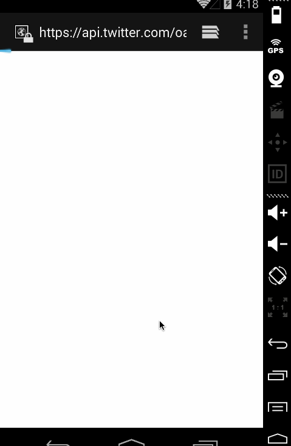

# Twitter

Built a simple Twitter client that supports viewing a Twitter timeline and composing a new tweet.

Time spent: 10 hours spent in total

Completed user stories:

 * [x] Required: User can sign in to Twitter using OAuth login
 * [x] Required: User can view the tweets from their home timeline
- User should be able to see the username, name, body and timestamp for each tweet
- User should be displayed the relative timestamp for a tweet "8m", "7h"
- User can view more tweets as they scroll with infinite pagination
 * [x] Required: User can compose a new tweet
- User can click a “Compose” icon in the Action Bar on the top right
- User can then enter a new tweet and post this to twitter
- User is taken back to home timeline with new tweet visible in timeline

 * [x] Optional: Did some styling to make it look a little more like twitter

 
Walkthrough of all user stories:

