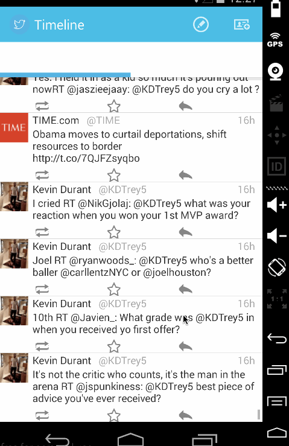

# Twitter

Built a simple Twitter client that supports viewing a Twitter timeline and composing a new tweet using Twitter's APIs. Done as practice for Android devopment. 

Features: OAuth login, composing tweets, viewing tweets, infinite scrolling

 
Walkthrough of all user stories:

